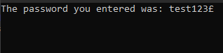

[](https://github.com/NuKeFluffy/PassCryptor/releases)
[](https://badge.fury.io/nu/PassCryptor)
[](https://github.com/NuKeFluffy/PassCryptor/releases)
[](https://www.nuget.org/packages/PassCryptor/)  

# PassCryptor
A basic .NET utility to hide user entered passwords during authentication.

# Installation: [NuGet](https://www.nuget.org/)
```
Install-Package PassCryptor
```
# Usage:
### Get started
Usage example (C#):
```csharp
using System;
using PassCryptor; // Imports the library

namespace Example
{
    class Program
    {
        static void Main(string[] args)
        {
            Cryptor cryptor = new Cryptor(); // Creates an instance of the Cryptor Class
            
            cryptor.HashKey = '*'; // **Optional** Sets a custom hash key (default: '*')
            cryptor.InputMessage = "Enter your password: "; // **Optional** Sets a custom input message (default: "Password: ")
            
            string password = cryptor.GetPassword(); // Goes through the process of encrypting user input and returns the clean password
            
            Console.WriteLine("The password you entered was: " + password); // Outputs the password to the console
            Console.ReadKey(); // Prevents program from exiting
        }
    }
}
```
Usage example (Visual Basic):
```vb.net
Imports PassCryptor ' Imports the library

Module Example

    Sub Main()

        Dim cryptor As Cryptor = New Cryptor() ' Creates an instance of the Cryptor Class

        cryptor.HashKey = "*" ' **Optional** Sets a custom hash key (default: '*')
        cryptor.InputMessage = "Enter your password: " ' **Optional** Sets a custom input message (default: "Password: ")

        Dim password As String = cryptor.GetPassword() ' Goes through the process of encrypting user input and returns the clean password

        Console.WriteLine("The password you entered was: " + password) ' Outputs the password to the console
        Console.ReadKey() ' Prevents program from exiting

    End Sub

End Module
```
Usage example (F#):
```fsharp
open System
open PassCryptor // Imports the library

[<EntryPoint>]
let main argv =

    let cryptor = new Cryptor() // Creates an instance of the Cryptor Class

    cryptor.HashKey <- '*' // **Optional** Sets a custom hash key (default: '*')
    cryptor.InputMessage <- "Enter your password: " // **Optional** Sets a custom input message (default: "Password: ")

    let password = cryptor.GetPassword() // Goes through the process of encrypting user input and returns the clean password

    Console.WriteLine("The password you entered was: " + password) // Outputs the password to the console
    Console.ReadKey() |> ignore // Prevents program from exiting

    0
```
Console output if user enters "test123£":





## Contacts
**Discord**: NuKe Fluffy#6016

**E-Mail**: nukefluffy0@gmail.com
